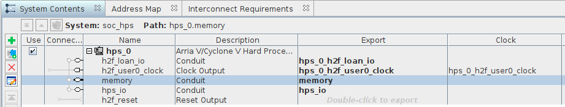
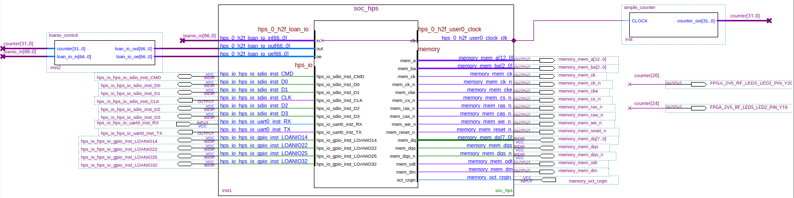

# Blink through LoanIOs in Chameleon96

Intro
-----

#### Objective

* Design and compile an FPGA core using the LOAN I/O function to use I/O normally assigned to the HPS from the FPGA side.
* We will do another blink example this time with the four user leds of the Chameleon96 board which are by default controlled from HPS side (ARM).
* We will keep also the blink of the WIFI and the BT leds from the previous tutorial.

#### Prerequisites

* Chameleon96 board
* Quartus lite software

#### Considerations
This tutorial has been made with this software setup:

* OS Ubuntu 20.04
* Quartus lite 20.1

There shouldn't be any major problem for following this tutorial with older versions of Quartus and/or if you are on Windows OS.

#### Sources of information

* [Blink from scratch tutorial](https://github.com/somhi/kameleon96/tree/master/1-blink-scratch-tutorial) 
* [Rætro's docs](https://docs.raetro.com/books/arrow-chameleon96/page/overview) 
* [Chameleon96 telegram group](https://t.me/Chameleon96)
	* Note: credits for the very first loanio blink code goes to our community member Sysadmin

#### Download files

* Complete Quartus project [./2.blink-loanio.zip](./readme_files/2.blink-loanio.zip)  
* Preloader for this project  [./u-boot-with-spl.sfp](./readme_files/u-boot-with-spl.sfp)  (from community member Sysadmin)

Preparation
-----------

We will start from were we left it in the previous example from this series: [Blink from scratch tutorial](https://github.com/somhi/kameleon96/tree/master/1-blink-scratch-tutorial)  

From a file browser, copy the folder containing all the code of the previous tutorial into another folder and rename it to e.g. "blink-loanio".

Quartus app
-----------

Launch the Quartus app.

Open the project file: File > Open project > browse inside folder you copied in previous step > select .qpf file (e.g. blink.qpf) > Open

Open the platform designer file: File > Open > select "soc_hps.qsys" created in previous tutorial > Open

Platform designer (Qsys)
------------------------

Double click hps_0 component from System Contents to open its properties.

Select the Peripheral Pins tab.

We are going to activate two functionalities that are needed in further steps for the system to work: 

* SD/MMC Controller
	* SDIO pin: HPS I/O Set 0
	* SDIO mode: 4-bit Data
* UART Controllers
	* UART0 pin: HPS I/O Set 1
	* UART0 mode: No Flow Control

Now, in the Peripherals Mux Table, we will select the pins that we want to use with the FPGA.

* Click on buttons LOANIO14, LOANIO22, LOANIO25, LOANIO32 which correspond to the pins assigned to the four user leds in the Chameleon96 board, according to it's schematic. Clicking on these buttons we will change the current assigment from the HPS system (ARM processors) to the FPGA side.

Close the parameter window.

In System Contents,  double click to export on  Export field for the following elements:

* h2f_loan_io
* hps_io
* memory

This is the final configuration for this tutorial:

File > Save

Click Generate HDL button at bottom page > Generate > Close  

Click Finish button 

Quartus app
-----------

Back in Quartus app, you should have already open in the block editor the file "blink.bdf".  

Left click on the soc_hps to move the block to the left, so we have enough space when we update the block.
Also move output pins from previous tutorial to the right.  

Right click on the soc_hps block > Update symbol or block > Selected symbol or block > Ok  

Now we will insert a new block created from Verilog code which will control the loanios I/O.

File > New > Verilog HDL File > Ok

Paste the following Verilog code:   

	module loanio_control (					
				// define input / output parameters of the module
				input wire 	[31:0] counter,		//counter input coming from the simple_counter module
				input wire [66:0] loan_io_in,		//loan io inputs coming from soc_hps block
				output wire [66:0] loan_io_out,	//loan io outputs going to soc_hps block
				output wire [66:0] loan_io_oe		//loan io enable outputs going to soc_hps block
				);
				
	//enable (1) the outputs which we are defined before (14, 22, 25, 32)
	assign loan_io_oe[14] = 1'b1;
	assign loan_io_oe[22] = 1'b1;
	assign loan_io_oe[25] = 1'b1;
	assign loan_io_oe[32] = 1'b1;
	
	//set the enable output value to zero for the rest of pins (this is just to avoid warnings from compiler)
	assign loan_io_oe[13:0] = 14'b0;			
	assign loan_io_oe[21:15] = 7'b0;	
	assign loan_io_oe[24:23] = 2'b0;	
	assign loan_io_oe[31:26] = 6'b0;	
	assign loan_io_oe[66:33] = 34'b0;	
	
	//assign to each output loanio pin the value from the counter input
	assign loan_io_out[14] = counter[22];
	assign loan_io_out[22] = counter[23];
	assign loan_io_out[25] = counter[24];
	assign loan_io_out[32] = counter[25];
	
	//assign to rest of outputs a zero value (this is just to avoid warnings from compiler)
	assign loan_io_out[13:0] = 14'b0;			
	assign loan_io_out[21:15] = 7'b0;	
	assign loan_io_out[24:23] = 2'b0;	
	assign loan_io_out[31:26] = 6'b0;	
	assign loan_io_out[66:33] = 34'b0;	
	
	endmodule						

File > Save as >  loanio_control.v       (leave checked 'Add file to current project')

File > Create/Update > Create Symbol Files for Current File

Go back to Block editor window (blink.bdf)  

Symbol tool > libraries > Project/loanio_control > Ok, Insert block in the diagram and press Esc key

Move the loanio_control block to the left of the soc_hps block and connect the bus wires ...out and ...oe as the image below.

Draw a bus line connected on the output port hps_0_h2f_loan_io_in of the soc_hps block, and leave the other end unconnected to the left of the block.  
Select the created bus line > right click > properties > type loanio_in[66..0] as the bus name.  

Draw a bus line connected on the input port loan_io_in of the loanio_control block, and leave the other end unconnected to the left of the block.  
Select the created bus line > right click > properties > type loanio_in[66..0] as the bus name.  

Draw a bus line connected on the input port counter of the loanio_control block, and leave the other end unconnected to the left of the block.  
Select the created bus line > right click > properties > type counter[31..0] as the bus name.  

Now we have to connect the rest of the ports from the soc_hps block to the corresponding pins from the board.  
Right click on the soc_hps block > Generate pins for symbol ports

Notice for now the four generated pins for LOANIO14/22/25/32 ports.  These pins are the ones connecting to the physical user leds on the board.

Save the diagram (shortcut Crtl + S).

Compiling the code
------------------

Now we will start the process for transforming the code files into a core image for the FPGA.
We are not going to Start compilation yet. We will need to do it in various steps to prevent compiling errors.

Menu Processing  >  Start > Start Analysis & Synthesis
If all is ok it should return following message: Quartus Prime Analysis & Synthesis was successful. 0 errors, xx warnings.

After that we need to generate all the required set instance assignments in the project file blink.qsf to prevent errors related to sdram which we are not using yet.  
Menu Tools > Tcl scripts... >  select hps_sdram_p0_pin_assignments.tcl  > Run > Ok > Close
If all is Ok it should return following message:  Evaluation of Tcl script ...hps_sdram_p0_pin_assignments.tcl was successful

And finally compile the full project:  

Processing  >  Start compilation

If all is Ok it should return following message: Quartus Prime Full Compilation was successful. 0 errors, xx warnings.

Programming the core into the FPGA
----------------------------------

Now it's time to Program the core into the FPGA like we did in the previous tutorial [Blink from scratch tutorial.](https://github.com/somhi/kameleon96/tree/master/1-blink-scratch-tutorial)

In this case though, we will need the SD card inserted.  

After pressing the "Start" button and progress is 100% (successful) you should have both leds (Wifi & BT) blinking  ;)  at different frequencies.

What happened with the LOANIO user leds ?
-----------------------------------------

Assignment of the I/Os to HPS / FPGA is made during boot time in the preloader (SPL).  The preloader from the original SD card should be changed with a new one generated with the settings data from Quartus and the BSP editor app from Intel FPGA Embedded Command Shell (Intel SoC EDS (Embedded Development Suite) is required).

If you just want to run this tutorial and see the four user leds blinking, just replace the preloader with this one already made ( file: [./u-boot-with-spl.sfp](./readme_files/u-boot-with-spl.sfp)). 

If you want to do the full process yourself and/or add other loanIO pins,  you should generate your own preloader. 

See next tutorial (3-SD-card+Preloader) to learn how to do it in both ways.

Final considerations
--------------------
In order to avoid compiling errors the following elements were required into the project:

* Qsys
	* Export memory from hps_0 component
	* In hps_0 properties add SD and UART controllers into the Peripheral Pins tab (this is needed for boot process from SD card)
* Quartus
	* Add IO pins in top-level design   > Generate pins for symbol ports 
	* Add sdram parameters into .qsf project file > run tcl script  hps_sdram_p0_pin_assignments.tcl after Analysis & Synthesis

