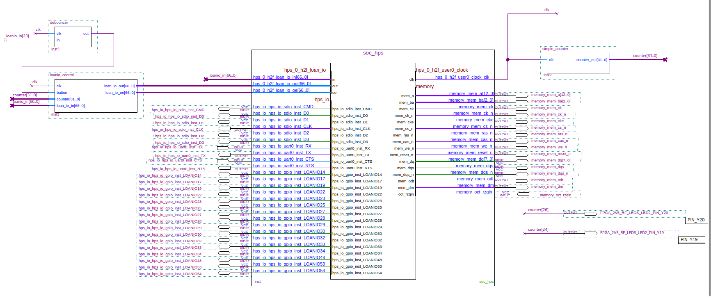

# Blink with external button
Intro
-----

### Objective

* Design and compile an FPGA core using the LOAN I/O function to use pins from the low speed 40 pin connector.
* Load memory settings of Chameleon96 board
* Do a blink with an external led when an external button is pressed


### Prerequisites

* Chameleon96 board
* [Quartus lite sofware](https://fpgasoftware.intel.com/?edition=lite)
* [Intel SoC EDS](https://fpgasoftware.intel.com/soceds/) (Embedded Development Suite) 


### Considerations
This tutorial has been made with this software setup:

* OS Ubuntu 20.04
* Quartus lite 20.1

There shouldn't be any major problem for following this tutorial with older versions of Quartus and/or if you are on Windows OS.  

**Note: From now on the tutorials will have less explanations and contain more technical detail as you should have enough level to develop yourself if you followed the previous tutorials.  **

### Sources of information

* [Chameleon96 telegram group](https://t.me/Chameleon96)
* __[github.com/somhi/kameleon96/](https://github.com/somhi/kameleon96)__


### Download files

* Complete Quartus project __xxxxxxxxxxxxxx__
* Memory settings __xxxxxxxxx__


Preparation
-----------

We will start from were we left it in the previous tutorials.  

From a file browser, copy the folder containing all the code of the previous tutorial (Blink loanIOs) into another folder and rename it to e.g. "blink-loanio-LS_connector".

Quartus app starting
--------------------

Launch the Quartus app.

Open the project file: File > Open project > browse inside folder you copied in previous step > select .qpf file (e.g. blink.qpf) > Open

Open the platform designer file: File > Open > select "soc_hps.qsys" > Open


Platform designer (Qsys)
------------------------

Double click hps_0 component from System Contents to open its properties.
Select the Peripheral Pins tab. In the Peripherals Mux Table, we will select the pins that we want to use with the FPGA.

LoanIO's for user leds  (already selected in the previous Blink loanIOs tutorial):
| Loanio number | Schematic name                 | Pin number | FPGA Bank |
|:--------------|:-------------------------------|:-----------|:----------|
| LOANIO14      | CV_HPS_1V8_GPIO14_via_NAND_ALE | user led 3 | BANK 7B   |
| LOANIO22      | CV_HPS_1V8_GPIO22_via_NAND_DQ3 | user led 2 | BANK 7B   |
| LOANIO25      | CV_HPS_1V8_GPIO25_via_NAND_DQ6 | user led 1 | BANK 7B   |
| LOANIO32      | CV_HPS_1V8_GPIO32_via_QSPI_IO3 | user led 0 | BANK 7B   |


LoanIO's for LS connector GPIO pins:
| Loanio number | Schematic name                  | Pin number | FPGA Bank |
|:--------------|:--------------------------------|:-----------|:----------|
| LOANIO33      | CV_HPS_1V8_GPIO33_via_QSPI_SS0  | LS_P24     | BANK 7B   |
| LOANIO34      | CV_HPS_1V8_GPIO34_via_QSPI_CLK  | LS_P26     | BANK 7B   |
| LOANIO27      | CV_HPS_1V8_GPIO27_via_NAND_WP   | LS_28      | BANK 7B   |
| LOANIO29      | CV_HPS_1V8_GPIO29_via_QSPI_IO0  | LS_30      | BANK 7B   |
| LOANIO28      | CV_HPS_1V8_GPIO28_via_NAND_WE   | LS_32      | BANK 7B   |
| LOANIO30      | CV_HPS_1V8_GPIO30_via_QSPI_IO1  | LS_34      | BANK 7B   |
| LOANIO19      | CV_HPS_1V8_GPIO19_via_NAND_DQ0  | LS_23      | BANK 7B   |
| LOANIO17      | CV_HPS_1V8_GPIO17_via_NAND_RE   | LS_25      | BANK 7B   |
| LOANIO54      | CV_HPS_1V8_GPIO54_via_TRACE_D5  | LS_27      | BANK 7A   |
| LOANIO48      | CV_HPS_1V8_GPIO48_via_TRACE_CLK | LS_29      | BANK 7A   |
| LOANIO53      | CV_HPS_1V8_GPIO53_via_TRACE_D4  | LS_31      | BANK 7A   |
| LOANIO23      | CV_HPS_1V8_GPIO23_via_NAND_DQ4  | LS_33      | BANK 7B   |


Note: Voltage out of LoanIO pins in low speed connector is 1,8 VDC

Close the parameter window.

Click Generate HDL button at bottom page > Generate > Close  

Quartus app development
-----------------------

Back in Quartus app, you should have already opened in the block editor the file "blink.bdf".  

Perform the following tasks:

* Update "soc_hps" block (right click > udate symbol or block)
* Add missing pins (right click >  generate pins for symbol ports)
* Update the block diagram as per the following instructions and according to the below screenshot: 
	* Draw a node wire out of soc_hps clock and name it "clk"
	* Modify the "loanio_control" block to add two inputs (clk, button). 
		* Double click on it and modify the code as per the code below. 
		* Save it and update the block (File > Create/Update > Create Symbol Files for Current File).
		* Update the block in the block editor (right click > udate symbol or block)
	* Create a new block for the button debouncer function:
		* Create a new verilog file  (File > New > Verilog HDL File > Ok)
		* Paste the below code  and save it as "debouncer.v" 
		* Create the block (File > Create/Update > Create Symbol Files for Current File)
		* Back in block editor insert the created debouncer block
	* Connect missing input/output node wires from "debouncer" and "loanio_control" blocks as per the below block diagram
		* Notice the input "in" of the debouncer block which is a node wire named "loanio_in[23]". Number 23 identifies the signal LOANIO23 which is physically connected to the low speed connector pin LS_PIN 33. In this pin we will have to connect the external button
	* Compile the project
		* If you've got error, compile like descrived in Blink loanIOs tutorial


### Top Block diagram



### Loanio_control verilog code

```
module loanio_control (					
			// define input / output parameters of the module
			input  wire	clk,				//clock input
			input  wire	button,
			input  wire [31:0] counter,		//counter input coming from the simple_counter module
			input  wire [66:0] loan_io_in,	//loan io inputs coming from soc_hps block
			output wire [66:0] loan_io_out,	//loan io outputs going to soc_hps block
			output wire [66:0] loan_io_oe	//loan io enable outputs going to soc_hps block
			);

reg button_status;		

//enable (1) the outputs
assign loan_io_oe[14] = 1'b1;
assign loan_io_oe[22] = 1'b1;
assign loan_io_oe[25] = 1'b1;
assign loan_io_oe[34:32] = 3'b111;
assign loan_io_oe[30:27] = 4'b1111;
assign loan_io_oe[17] = 1'b1;
assign loan_io_oe[19] = 1'b1;
assign loan_io_oe[48] = 1'b1;
assign loan_io_oe[54:53] = 2'b11;

//set the enable output value to zero for the rest of pins (this is just to avoid warnings from compiler)
assign loan_io_oe[23] = 1'b0;				//LS_PIN 33  Connected to an external button
assign loan_io_oe[13:0] = 14'b0;		
//......
	

initial begin
	button_status <= 1'b0;
end

always @ (posedge clk) 
begin
	if (button == 1'b1)
		button_status <= 1'b0;
	else
		button_status <= 1'b1;
end


//assign to each output loanio pin the value from the counter input or from an external button

//USER LEDS
assign loan_io_out[14] = button_status;		// user led 3
assign loan_io_out[22] = counter[23];	   	// user led 2
assign loan_io_out[25] = counter[24];		// user led 1 
assign loan_io_out[32] = button_status;		// user led 0 

//LS_Connector 
assign loan_io_out[33] = button_status;		//pin 24		
assign loan_io_out[34] = counter[24];		//pin 26		
assign loan_io_out[27] = counter[24];		//pin 28		
assign loan_io_out[29] = button_status;		//pin 30		
assign loan_io_out[28] = counter[25];		//pin 32		
assign loan_io_out[30] = counter[26];		//pin 34		 

//LS_Connector 
assign loan_io_out[19] = counter[24];		//pin 23		
assign loan_io_out[17] = counter[23];		//pin 25		
assign loan_io_out[54] = counter[22];		//pin 27		
assign loan_io_out[48] = button_status;		//pin 29		
assign loan_io_out[53] = counter[24];		//pin 31		

//assign to rest of outputs a zero value (this is just to avoid warnings from compiler)
assign loan_io_out[13:0] = 14'b0;
//......

endmodule					
```


### Debouncer verilog code

```
//-- Debouncer Circuit
//-- It produces a stable output when the
//-- input signal is bouncing
 
module debouncer (
			input wire clk,
			input wire  in,		//loan io inputs coming from soc_hps block
			output wire out
			); 
 
reg btn_prev = 0;
reg btn_out_r = 0;
reg [16:0] counter = 0;
 
always @(posedge clk) begin
 
  //-- If btn_prev and btn_in are differents
  if (btn_prev ^ in == 1'b1) begin
 
      //-- Reset the counter
      counter <= 0;
 
      //-- Capture the button status
      btn_prev <= in;
  end
 
  //-- If no timeout, increase the counter
  else if (counter[16] == 1'b0)
      counter <= counter + 1;
 
  else
    //-- Set the output to the stable value
    btn_out_r <= btn_prev;
 
end
 
assign out = btn_out_r;

endmodule
```


