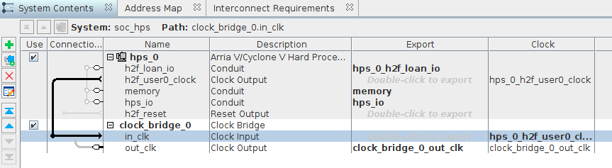
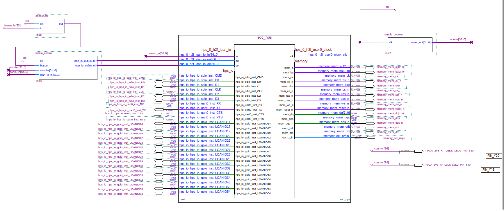
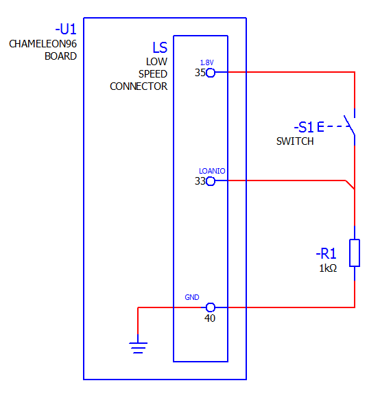

# Blink with external button
### Table of contents

* Intro 
	* Objective 
	* Prerequisites 
	* Considerations 
	* Sources of information 
	* Download files 
* Quartus app starting 
* Platform designer (Qsys) 
* Load memory preset settings for Chameleon96 board (Qsys) 
* Quartus app development 
	* Top Block diagram 
	* Simple_counter module (Verilog code) 
	* LoanIO_control module (Verilog code) 
	* Debouncer module (Verilog code) 
* Generate preloader, burn it into the SD and program the core 
* External circuit schematic 
* Final considerations 


Intro
-----

### Objective

* Design and compile an FPGA core using the LOAN I/O function to use pins from the low speed 40 pin connector.
* Load memory preset settings for Chameleon96 board
* Blink user leds 0 and 3 pressing an external button with debouncer function


### Prerequisites

* Chameleon96 board
* [Quartus lite sofware](https://fpgasoftware.intel.com/?edition=lite)
* [Intel SoC EDS](https://fpgasoftware.intel.com/soceds/) (Embedded Development Suite) 


### Considerations
This tutorial has been made with this software setup:

* OS Ubuntu 20.04
* Quartus lite & EDS 17.1

There shouldn't be any major problem for following this tutorial with other versions of Quartus and/or if you are on Windows OS.  

**Note: From now on the tutorials will have less explanations and contain more technical detail as you should have enough level to develop yourself if you followed the previous tutorials.  **

For more explanations check previous tutorials.

**Note: Adapt suggested filenames as per your convenience.  **

**Note: The aim of this tutorial is just to be able to program the FPGA with your cores. Keep in mind that would surely loose access to the linux part as configuring the right parameters in Qsys / u-boot is out of the scope of this tutorial. Returning the linux functionality is easy if you have a backup of the u-boot partition and restore it afterwards (see previous tutorial).**

### Sources of information

* [Chameleon96 telegram group](https://t.me/Chameleon96)
* [github.com/somhi/kameleon96/](https://github.com/somhi/kameleon96)


### Download files

* Complete Quartus project [./4_17.blink-loanio-LS_connector.zip](./README_files/4_17.blink-loanio-LS_connector.zip)
* Preset memory settings [./DDR3_c96_Preset_1.qprs](./README_files/DDR3_c96_Preset_1.qprs)


Quartus app starting
--------------------

Launch the Quartus app:

* File > New project wizard
	* Next > choose folder and project name (e.g. blink), Next  > empty project, Next > Next >  
	* type 5CSEBA6U19I7  in name filter, Next > Next > Finish
* File > New > Block Diagram/Schematic File 
* File > Save as >  blink.bdf
* File > New > Qsys System file		this opens Platform designer app


Platform designer (Qsys)
------------------------

Proceed as follows:

* System contents window > select clk_0 > right click > remove
* IP catalog > search "hps" > select "ArriaV/Cyclone V HPS" > Add
* ArriaV/Cyclone V HPS configuration window 
	* FPGA interfaces > uncheck Enable MPU ...
	* AXI Bridges > put all 3 to Unused
	* FPGA-to-HPS SDRAM Interface
		* select  f2h_sdram0 and remove it with minus icon
	* HPS Clocks > Output clocks > HPS-to-FPGA User Clocks
		* check Enable HPS-to-FPGA user 0 clock
	* Select the Peripheral Pins tab.
		* SD/MMC Controller
			* SDIO pin: HPS I/O Set 0
			* SDIO mode: 4-bit Data
		* UART Controllers
			* UART0 pin: HPS I/O Set 1
			* UART0 mode: No Flow Control


Now, in the Peripherals Mux Table, we will select the following LoanIO pins that we want to use with the FPGA.

LoanIO's for user leds:
| Loanio number | Schematic name                 | Pin number | FPGA Bank |
|:--------------|:-------------------------------|:-----------|:----------|
| LOANIO14      | CV_HPS_1V8_GPIO14_via_NAND_ALE | user led 3 | BANK 7B   |
| LOANIO22      | CV_HPS_1V8_GPIO22_via_NAND_DQ3 | user led 2 | BANK 7B   |
| LOANIO25      | CV_HPS_1V8_GPIO25_via_NAND_DQ6 | user led 1 | BANK 7B   |
| LOANIO32      | CV_HPS_1V8_GPIO32_via_QSPI_IO3 | user led 0 | BANK 7B   |


LoanIO's for LS connector GPIO pins:
| Loanio number | Schematic name                  | Pin number | FPGA Bank |
|:--------------|:--------------------------------|:-----------|:----------|
| LOANIO33      | CV_HPS_1V8_GPIO33_via_QSPI_SS0  | LS_P24     | BANK 7B   |
| LOANIO34      | CV_HPS_1V8_GPIO34_via_QSPI_CLK  | LS_P26     | BANK 7B   |
| LOANIO27      | CV_HPS_1V8_GPIO27_via_NAND_WP   | LS_28      | BANK 7B   |
| LOANIO29      | CV_HPS_1V8_GPIO29_via_QSPI_IO0  | LS_30      | BANK 7B   |
| LOANIO28      | CV_HPS_1V8_GPIO28_via_NAND_WE   | LS_32      | BANK 7B   |
| LOANIO30      | CV_HPS_1V8_GPIO30_via_QSPI_IO1  | LS_34      | BANK 7B   |
| LOANIO19      | CV_HPS_1V8_GPIO19_via_NAND_DQ0  | LS_23      | BANK 7B   |
| LOANIO17      | CV_HPS_1V8_GPIO17_via_NAND_RE   | LS_25      | BANK 7B   |
| LOANIO54      | CV_HPS_1V8_GPIO54_via_TRACE_D5  | LS_27      | BANK 7A   |
| LOANIO48      | CV_HPS_1V8_GPIO48_via_TRACE_CLK | LS_29      | BANK 7A   |
| LOANIO53      | CV_HPS_1V8_GPIO53_via_TRACE_D4  | LS_31      | BANK 7A   |
| LOANIO23      | CV_HPS_1V8_GPIO23_via_NAND_DQ4  | LS_33      | BANK 7B   |


Note: Output voltage for LoanIO pins in low speed connector is 1,8 VDC


* Close the parameter window.


* IP Catalog > search "bridge" > select "Clock Bridge" > Add > Finish
* Connect the output from the user 0 clock to the clock bridge (this will be useful in the future when you need to use this clock in Qsys and at the same time export it)
	* Click the dot from the greyed arrow that goes from hps_0.h2f_user0_clock to clock_bridge_0 so it becomes a bold arrow


* In System Contents,  we have to export the following elements:
	* h2f_loan_io
	* hps_io 
	* memory 
	* out_clk (from the clock bridge)


This is the final configuration for this tutorial:



* File > Save as >  soc_hps.sys
* Click Generate HDL button at bottom page > Generate > Close  
* Click Finish to close Qsys.


Load memory preset settings for Chameleon96 board (Qsys)
--------------------------------------------------------

This point explains how to configure the memory settings of the Chameleon96 board into the platform designer. 
We will load a presets file which has proven to work.  

Follow these steps from a file explorer:

* Browse to the project folder
* create a new folder named "ip" and inside it another folder named "presets"
* Copy this file ( [./DDR3_c96_Preset_1.qprs](./README_files/DDR3_c96_Preset_1.qprs) ) inside the [/ip/presets/](file:///ip/presets) folder. This file contains the preset settings for the Chameleon96 board.


If Qsys is still open, close it.  
From Quartus open the platform designer file: File > Open > select "soc_hps.qsys" > Open

* Select View menu > Presets
* Select the preset "DDR3_c96_Preset_1" from the Project tree and press "Apply" button
* Close the presets window
* Check that the  SDRAM settings of the hps_0 component have changed
	* Double click hps_0 component from System Contents to open its properties.
	* Press the SDRAM tab and see all the new parameters have loaded (you should compare before and after applying presets).
* Click Generate HDL button at bottom page > Generate > Close  
* Click Finish to close Qsys.


Quartus app development
-----------------------

Back in Quartus app, you should have already opened in the block editor the file "blink.bdf".  

Perform the following tasks:

* Menu Project > Add/Remove files in project  > ...  > select ./soc_hps/synthesis/soc_hps.qip, click  Open > Ok
* Create a block for the counter module:
	* Create a new Verilog file  (File > New > Verilog HDL File > Ok)
	* Paste the below code  and save it as "simple_counter.v" 
	* Create the block (File > Create/Update > Create Symbol Files for Current File)


Design the  block diagram as per the following instructions and according to the below diagram: 

* Insert the soc_hps block generated by platform designer
* Add missing pins (right click >  generate pins for symbol ports)
* Insert the simple counter block
* Connect the node wires connecting the soc_hps clock output and the simple counter 
* Draw a node wire out of soc_hps clock and name it "clk"
* Pin tool > Insert two output pins on the page  
	* Double click on pin_name1  > pin name > type FPGA_2V5_RF_LEDS_LED2_PIN_Y20  
	* Double click on pin_name2  > pin name > type FPGA_2V5_RF_LEDS_LED2_PIN_Y19
* Connect to those pins node wires named "counter[26]" and "counter[24]" respectively


* Create a block for the loanio control module:
	* Create a new Verilog file  (File > New > Verilog HDL File > Ok)
	* Paste the below code  and save it as "loanio_control.v" 
	* Create the block (File > Create/Update > Create Symbol Files for Current File)
* Insert the loanio control block
* Delete the three pins connecting the hps loan In/out/oe
* Draw a bus line for hps loanio in an name it "loanio_in[66..0]"
* Connect bust lines for hps loanio out/oe to the loanio control outputs
* Draw bus lines at the input of loanio_control block and name it "counter[31..0]" and "loanion_in[66..0]"


* Create a new block for the button debouncer function:
	* Create a new Verilog file  (File > New > Verilog HDL File > Ok)
	* Paste the below code  and save it as "debouncer.v" 
	* Create the block (File > Create/Update > Create Symbol Files for Current File)
	* In block editor insert the created debouncer block
* Connect missing input/output node wires from "debouncer" and "loanio_control" blocks as per the below block diagram
	* Notice the input "in" of the debouncer block which is a node wire named "loanio_in[23]". Number 23 identifies the signal LOANIO23 which is physically connected to the low speed connector pin LS_PIN 33. In this pin we will have to connect the external button


* In preparation for pin assignments do Processing > Start > Start Analysis & Elaboration 
* Assign location to the two inserted pins for Wifi & BT leds (Assignments > Pin Planner)
	* Bottom table >   FPGA_2V5_RF_LEDS_LED2_PIN_Y20    > Location >  PIN_Y20
	* Bottom table >   FPGA_2V5_RF_LEDS_LED2_PIN_Y219   > Location >  PIN_Y19


* Compile the project
	* Run Processing > "start analysis & synthesis", once to read the information
	* In "Tools" > "TCL Scripts...", run the script <my system>/synthesis/submodules/hps_sdram_p0_pin_assignments.tcl 
	* Run the full compilation (Processing  >  Start compilation)
	* If all is Ok it should return following message: Quartus Prime Full Compilation was successful. 0 errors, xx warnings.


### Top Block diagram


### Simple_counter module (Verilog code)

```
//It has a single clock input and a 32-bit output port
module simple_counter (
			clk,
			counter_out
			);
input 	clk;
output 	[31:0] counter_out;
reg 		[31:0] counter_out;

always @ (posedge clk)  	     		// on positive clock edge
begin
counter_out <= #1 counter_out + 1;		// increment counter
end
endmodule								// end of module counter
```


### LoanIO_control module (Verilog code)

This Verilog module does:

* Configure output loanios with the corresponding output enable set to 1
	* LOANIO23 has not been enabled as output as it will be used as input for the external button
* Continuosly check the button input status at the positive flange of the clock input (clk)
* Assign to user leds 1 and 2 fixed frequencies
* Assign to user leds 0 and 3 the output of the button status
* Assign to the GPIO loanIO's different pulse frequencies / button status (this can be check wit an oscilloscope) 


```
module loanio_control (					
			// define input / output parameters of the module
			input  wire	clk,				//clock input
			input  wire	button,
			input  wire [31:0] counter,		//counter input coming from the simple_counter module
			input  wire [66:0] loan_io_in,	//loan io inputs coming from soc_hps block
			output wire [66:0] loan_io_out,	//loan io outputs going to soc_hps block
			output wire [66:0] loan_io_oe	//loan io enable outputs going to soc_hps block
			);

reg button_status;		

//enable (1) the outputs
assign loan_io_oe[14] = 1'b1;
assign loan_io_oe[22] = 1'b1;
assign loan_io_oe[25] = 1'b1;
assign loan_io_oe[34:32] = 3'b111;
assign loan_io_oe[30:27] = 4'b1111;
assign loan_io_oe[17] = 1'b1;
assign loan_io_oe[19] = 1'b1;
assign loan_io_oe[48] = 1'b1;
assign loan_io_oe[54:53] = 2'b11;

//set the enable output value to zero for the rest of pins (this is just to avoid warnings from compiler)
assign loan_io_oe[23] = 1'b0;				//LS_PIN 33  Connected to an external button
assign loan_io_oe[13:0] = 14'b0;		
//......
	

initial begin
	button_status <= 1'b0;
end

always @ (posedge clk) 
begin
	if (button == 1'b1)
		button_status <= 1'b0;
	else
		button_status <= 1'b1;
end


//assign to each output loanio pin the value from the counter input or from an external button

//USER LEDS
assign loan_io_out[14] = button_status;		// user led 3
assign loan_io_out[22] = counter[23];	   	// user led 2
assign loan_io_out[25] = counter[24];		// user led 1 
assign loan_io_out[32] = button_status;		// user led 0 

//LS_Connector 
assign loan_io_out[33] = button_status;		//pin 24		
assign loan_io_out[34] = counter[24];		//pin 26		
assign loan_io_out[27] = counter[24];		//pin 28		
assign loan_io_out[29] = button_status;		//pin 30		
assign loan_io_out[28] = counter[25];		//pin 32		
assign loan_io_out[30] = counter[26];		//pin 34		 

//LS_Connector 
assign loan_io_out[19] = counter[24];		//pin 23		
assign loan_io_out[17] = counter[23];		//pin 25		
assign loan_io_out[54] = counter[22];		//pin 27		
assign loan_io_out[48] = button_status;		//pin 29		
assign loan_io_out[53] = counter[24];		//pin 31		

//assign to rest of outputs a zero value (this is just to avoid warnings from compiler)
assign loan_io_out[13:0] = 14'b0;
//......

endmodule					
```


### Debouncer module (Verilog code)

```
//-- Debouncer Circuit
//-- It produces a stable output when the
//-- input signal is bouncing
 
module debouncer (
			input wire clk,
			input wire  in,		//loan io inputs coming from soc_hps block
			output wire out
			); 
 
reg btn_prev = 0;
reg btn_out_r = 0;
reg [16:0] counter = 0;
 
always @(posedge clk) begin
 
  //-- If btn_prev and btn_in are differents
  if (btn_prev ^ in == 1'b1) begin
 
      //-- Reset the counter
      counter <= 0;
 
      //-- Capture the button status
      btn_prev <= in;
  end
 
  //-- If no timeout, increase the counter
  else if (counter[16] == 1'b0)
      counter <= counter + 1;
 
  else
    //-- Set the output to the stable value
    btn_out_r <= btn_prev;
 
end
 
assign out = btn_out_r;

endmodule
```


Generate preloader, burn it into the SD and program the core
------------------------------------------------------------

Perform the following tasks:

* Generate a new preloader and burn it into the SD card (as per the previous preloader tutorial)
	* [......../intelFPGA_lite/17.1/embedded/embedded_command_shell.sh](file:///intelFPGA_lite/17.1/embedded/embedded_command_shell.sh)
	* Run "bsp-editor"
		* Select File->New BSP and select the following:
			* Preloader settings directory > click the ... button then navigate to and select the folder inside the hps_isw_handoff folder
			* Leave the other settings at their defaults
		* The next window allows you to customize the preloader settings. Leave default settings
		* Click Generate. The BSP editor will create a software/spl_bsp folder to build the preloader in
		* Exit the program
	* Choose preferred u-boot version  
		* this tutorial uses the one included with EDS 17.1 (If you want to use another version of u-boot see previous tutorial).
	* You can now cd to the newly created folder inside the Quartus project main folder and make the preloader.


```
cd software/spl_bsp/
# if you opened a new terminal window run EDS again
# ...../intelFPGA_lite/17.1/embedded/embedded_command_shell.sh
make
```


* You should be left with a **preloader-mkpimage.bin** file, which is actually multiple copies of the preloader concatenated together, ready to be burned to your boot media (see below).


* Optionally you can also create the u-boot image


```
make uboot

```


* It generates the file **u-boot.img** inside the folder ".\software\spl_bsp\uboot-socfpga"
* Concatenate preloader and u-boot files to burn them altogether


```
cat preloader-mkpimage.bin ./uboot-socfpga/u-boot.bin > u-boot-partition.bin

```


* Burn the preloader  into the SD card
	* At the moment burning just the preloader into the original SD card is giving me an error which causes the board to reset itself continuously, so I recommend burning preloader + uboot which gets stuck after the preloader but it will allow us to program the core into the FPGA.


```
lsblk

#sd-card c96 original

# Burn concatenated preloader + u-boot
sudo dd if=u-boot-partition.bin of=/dev/sdXY
#[Replace sdXY with your own device X and partition Y (in my case is /dev/sdb3)]

# Burn just the preloader part (NOT RECOMMENDED WITH ORIGINAL Chameleon96 SD card)
sudo dd if=preloader-mkpimage.bin of=/dev/sdXY
#[Replace sdXY with your own device X and partition Y (in my case is /dev/sdb3)]

# As a note, if we wante to just burn the u-boot part
sudo dd if=u-boot.bin of=/dev/sdXY bs=64k seek=4
```


* Put the SD card in the Chameleon96 board and power it up
* Program the core into the FPGA
	* Open the programmer (Tools menu > Programmer) (blue led should be on with USB blaster cable connected)
	* Hardware Setup... > Hardware Settings > Double click "Arrow 96 CV SoC Board" and press Close button.
	* Add Device... > Soc Series V > double click SOCVHPS > Ok
	* Select the "SOCVHPS" and press "Up" button
	* Finally press the "Start" button and after a few seconds you should have the core running.


External circuit schematic
--------------------------

To test the core we need to mount an external circuit, according to the following schematic:





Final considerations
--------------------

It's time to experiment on your own ☺ 


