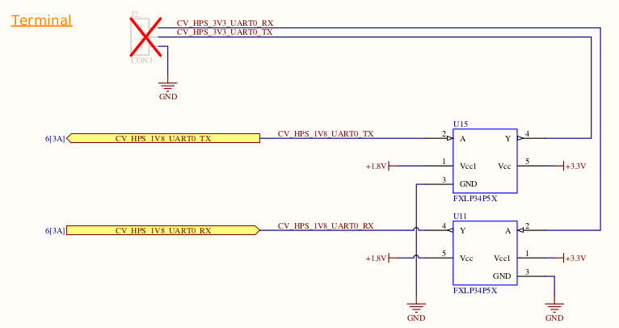
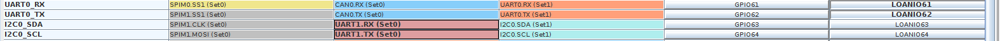

# Various notes
UART0 LOANIO
------------

HPS Config 	   UART0 unused							USER CLOCK 0 CHANGED TO 25 MHZ (CONFIG AT 100 MHz)
UART1 hps set 0  no flow control

HPS Config 	    UART0 FPGA full						USER CLOCK 0 STAYED AT 100 MHz
UART1 hps set 0  no flow control
assign loan_io_out[61] = counter[24];		//UART0_RX	GREEN	 does not output anything
assign loan_io_out[62] = hsync;				//UART0_TX	WHITE  ok vsync 60 Hz & hsync 31,5 kHz at 3,3 Vout  (no capacitor at Vout)

Enter uboot and change parameters
---------------------------------
so just keep pressing esc while you turn it on to get into it, then just change the delay to make it easier to get in when you need to shutdown or reboot... just do

=> setenv bootdelay 5
=> saveenv

Activate GPIOs
--------------
**from uboot**
from u-boot for example I can issue commands like
gpio clear <pin>
gpio set <pin>

gpio clear 25  		activa el userled 1
gpio clear 32  		activa el userled 0

**And from linux shell, or a C program** how do I put a GPIO to high or low state?
they should show up on /sys/class/gpio/gpio<pin_number>

