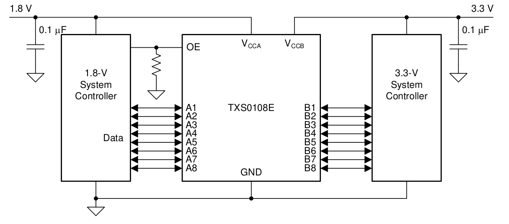

# Knight Rider 8 led effect

Intro
-----

### Objective

* Test a level shifter IC (TXS0108e) with the Chameleon96 loanIO outputs
  * Input voltage 1.8V from Chameleon96 (8 loanIO signals)
  * Output voltage 5 V to a 8 led array

* Code used for the test is knight rider by Miguel Angel Rodriguez Jodar which recreates the lights of the famous knight rider "kit" car

### Considerations
This tutorial has been made with this software setup:

* Quartus lite & EDS 17.1

  There shouldn't be any major problem for following this tutorial with other versions of Quartus.

### Sources of information

* [Chameleon96 telegram group](https://t.me/Chameleon96)
* FPGA_es telegram group
* [github.com/somhi/kameleon96/](https://github.com/somhi/kameleon96)

### Download files

* Complete Quartus project [5.blink-knight-rider-levelshifter.zip](./5.blink-knight-rider-levelshifter.zip)  
* Knight rider Verilog code [knigh_rider.v](./knigh_rider.v) by Miguel Angel Rodriguez Jodar (read license inside file)
* txs0108e datasheet [txs0108e.pdf](./txs0108e.pdf)

Quartus & Qsys project
--------------------

I'm using the previous project tutorial number 4 as a template.

Platform designer (Qsys) project did not change. Inside project folder you can find the preloader file used for this example (preloader-mkpimage.bin).

Added knight_rider Verilog file to the project, converted it to a block and inserted it in the top block diagram "blink.bdf".  Connected the clock input signal. 

Modified the loanio_control block to accept the 8 array output signal from the knight_rider block.

Inside loanio_control the 8 led signals are assigned to the LS connector loanIO pins. Check loanio_control.v code to know the exact pins assigned.

External circuit schematic
--------------------------

To test the core we need to mount an external circuit, adapting the following datasheet schematic to your circuit. I used 5 V for the output voltage. **I noticed the 5V pin from LS connector was not able to feed the 8 leds array so I end up using another power supply for the leds**. Don't forget to add proper resistors for the leds.

