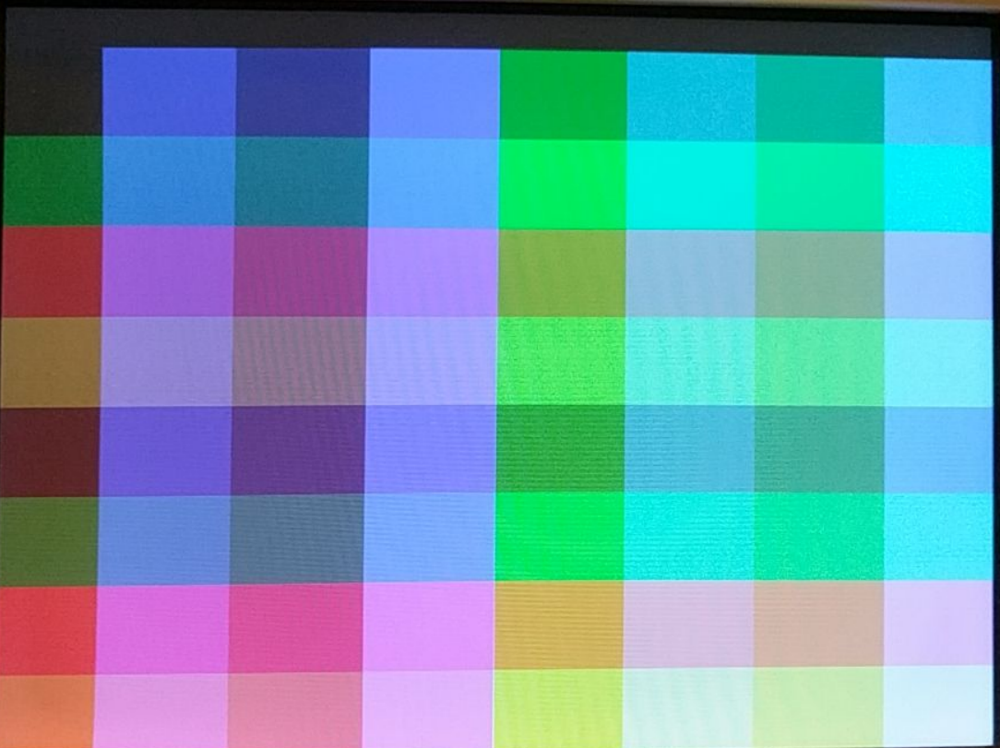
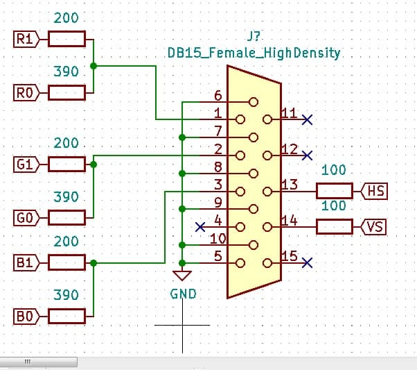
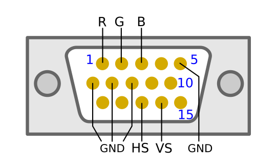
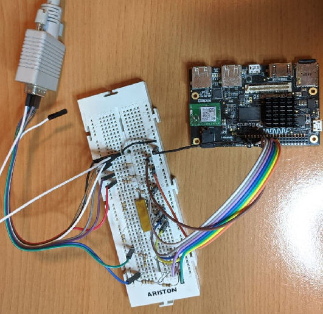

# VGA adapter 64 color test generator

Intro
-----

### Objective

* Build a custom made 6 bit VGA adapter and test it with the Chameleon96 board
  
* Code used for the test is VGA_C96 by Antonio Sánchez

### Considerations
This tutorial has been made with this software setup:

* Quartus lite & EDS 17.1

  There shouldn't be any major problem for following this tutorial with other versions of Quartus.

**The project did not work with my LCD monitor, but it does in a CRT tube monitor I have.** 

### Sources of information

* [Chameleon96 telegram group](https://t.me/Chameleon96)
* [github.com/somhi/kameleon96/](https://github.com/somhi/kameleon96)
* https://github.com/Alhambra-bits/AP-VGA
* https://github.com/Obijuan/Cuadernos-tecnicos-FPGAs-libres/wiki/CT.2:-VGA-Retro:-Puesta-en-marcha.-MonsterLED
* http://www.javiervalcarce.eu/html/vga-signal-format-timming-specs-en.html

### Download files

* Complete Quartus project [6.2.c96-vgaretro-pll-test.zip](./6.2.c96-vgaretro-pll-test.zip)  
* VGA_C96 Verilog code [VGA_C96.v](./VGA_C96.v) by Antonio Sánchez

Quartus & Qsys project
--------------------

I used the project tutorial number 4 as a template.

Platform designer (Qsys) project did not change. Inside project folder you can find the preloader file used for this example (preloader-mkpimage.bin).

Added Altera PLL as descrived in Documents/My_first_fpgaDE10-Nano  tutorial with a desired frequency of 12 MHz. **Note: It is better to add a PLL in quartus to set an exact frequency than changing HPS output frequency parameters in Qsys.**

Added VGA_C96.v Verilog file to the project, converted it to a block and inserted it in the top block diagram "blink.bdf".  Connected the clock input signal from the PLL.

Modified the loanio_control block to accept the output signals from the VGA_C96 block.

Inside loanio_control the 8 signals (2 red, 2 Blue, 2 Green, 2 Sync) are assigned to the LS connector loanIO pins. See below code from loanio_control.v assigning signals to external pins on low speed connector.

| //LS_Connector                     | LS_PIN   | SIGNAL | RESISTOR |
| ---------------------------------- | -------- | ------ | -------- |
| assign loan_io_out[48] = vsync;    | //pin 29 | VS     | 100 Ohm  |
| assign loan_io_out[17] = hsync;    | //pin 25 | HS     | 100 Ohm  |
| assign loan_io_out[19] = BLUE[1];  | //pin 23 | B0     | 390 Ohm  |
| assign loan_io_out[33] = BLUE[0];  | //pin 24 | B1     | 200 Ohm  |
| assign loan_io_out[34] = GREEN[1]; | //pin 26 | G0     | 390 Ohm  |
| assign loan_io_out[29] = GREEN[0]; | //pin 30 | G1     | 200 Ohm  |
| assign loan_io_out[28] = RED[1];   | //pin 32 | R0     | 390 Ohm  |
| assign loan_io_out[30] = RED[0];   | //pin 34 | R1     | 200 Ohm  |

Expected monitor output
--------------------------

  

External circuit schematic
--------------------------

To test the core we need to mount an external circuit following this schematic courtesy of Jaime Pérez: 

  

If you want to connect Dupont wires directly to the VGA connector take a bit of care but it is feasible. The ground connection in the middle is not really necessary so you would only need to connect 4 wires on top row, and 2 wires in the following rows as shown in this image.

Follows how it looks my test circuit:
