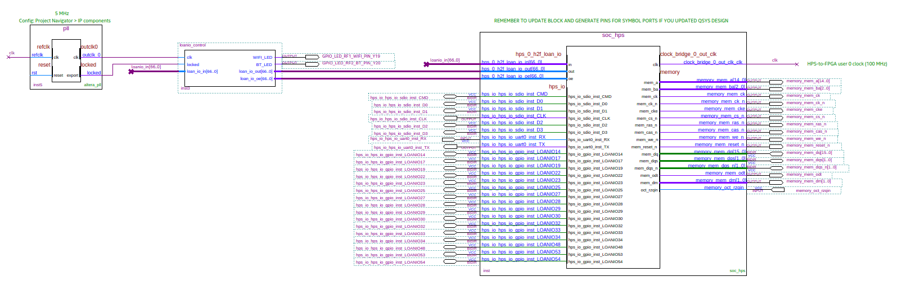
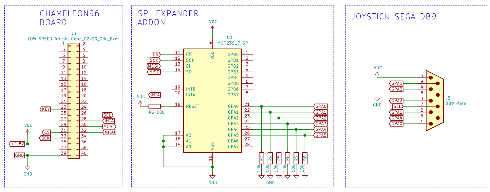
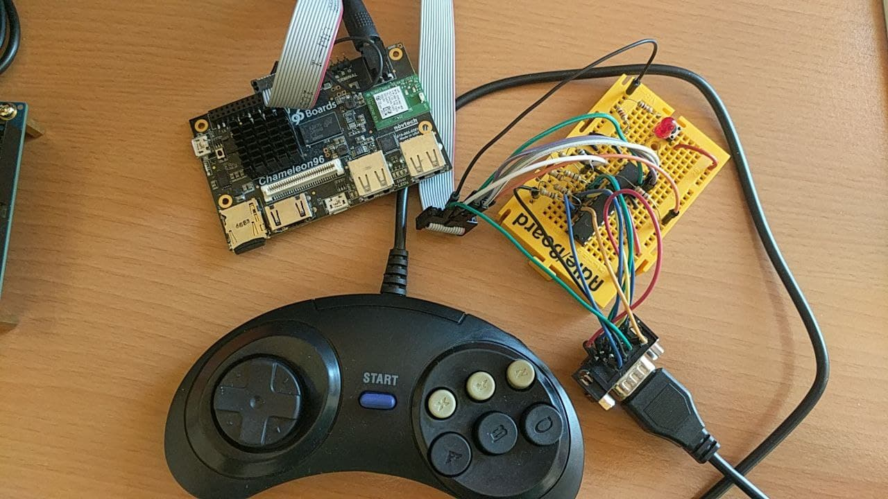

SPI GPIO expander (connected to the LTC connector)
-----

### Objectives

* Control an MCP23S17 SPI GPIO expander from FPGA side, using the pins available at the LTC connector from the Sockit board through LoanIO pins.  
* Test a Genesis Sega 6-button controller

### Resources of information

* [Hardware Lab 16](https://rocketboards.org/foswiki/pub/Documentation/ArrowSoCKitEvaluationBoard/SoCKIT_Materials_16.0.zip)
* [Chameleon96 loanio tutorials](https://github.com/SoCFPGA-learning/Chameleon96/tree/master/Tutorials)
* https://github.com/ranzbak/aars_joystick  SPI master and joystick controller (Xilinx project)
* MCP23S17 datasheet 
* Control module for Megadrive DB9 Splitter of Antonio Villena by Aitor Pelaez (NeuroRulez) Based on the module written by Victor Trucco and modified by Fernando Mosquera https://github.com/MiSTer-DB9/NeoGeo_MiSTer/blob/master/src/joydb9md.v
* Description of genesis controller pdf from https://sites.ualberta.ca/~delliott/cmpe490/appnotes/2016w/g6_genesis_controllers/

### Considerations

This project was developed on the SoCkit board and thereafter ported to Chameleon96 board.

Check https://github.com/SoCFPGA-learning/SoCKit/tree/main/Projects/3.3.gpio_expander_loanio_sega

### Block diagram of top-level entity

### Schematics

 [GPIO_expander_sockit schematic pdf](GPIO_expander.pdf) 

 [C96-Sega-Connections.ods](C96-Sega-Connections.ods) 

### Main parts BOM

* 1 ut IC I/O EXPANDER SPI 16B 28SDIP  (part MCP23S17-E/SP-ND) [(buy link)](https://www.mouser.es/ProductDetail/Microchip-Technology/MCP23S17-E-SP/?qs=%2Fha2pyFadujGtHimLqIg4AmW4vCSvXf1nM4oOC77TXAIdYVbFt74Gw%3D%3D)

* 1 ut DB9 female connector

  

### Picture of final assembly

