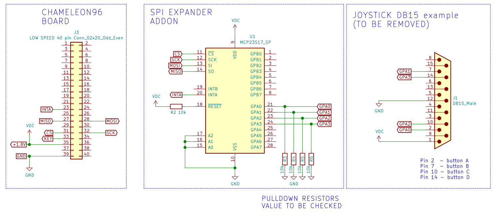

GPIO expander 
-----

### Objectives

* Control an MCP23S17 SPI GPIO expander from FPGA side, so we can get an extra 16 GPÌO for low speed operations (keyboards, joysticks, ...). It should be possible to add more GPIO expanders in the same SPI line.

### Resources of information

* https://github.com/ranzbak/aars_joystick  SPI master and joystick controller (Xilinx project)

* MCP23S17 datasheet 

* https://allpinouts.org/pinouts/connectors/input_device/joystick-pc-gameport/ Pinout joystick PC DB15

### Development

I took the github aars_joystick project and ported it from Xilinx to Altera. Basically I just had to remove the Xilinx PLL clock for the Altera PLL equivalent, change pins locations and changed some names of modules, ports and wires.   

Originally the code worked with a clock of 28 MHz. This could cause problems with breadboards and Dupont wires, and with lower voltages like 1.8V in the chameleon96, so frequency was reduced to 5 MHz that should be enough for most applications.

Check the original code if you intend the use it with two joysticks as I made minor changes to it, because I just had at hand a DB15 PC joystick from which I just tested 4 buttons and monitored the pressing with the 4 fpga onboard leds. 

### Schematic

See loanio_control.v for loanIO pin assigments in the Chameleon96 board to drive the SPI pins.