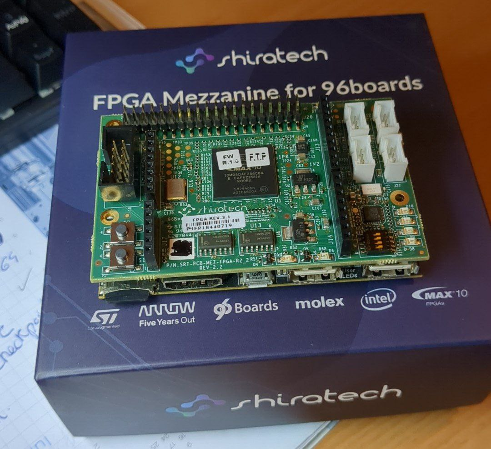

# 8.3 Mezzanine Clock

This is a typical blink project, alternating Wifi and Bluetooth leds on the Chameleon96 boards.

It has two sources of clocks to test different ways to obtain a clock in Chameleon96 board.

**Top file**: rtl/CV_96.v

On top of that file you can choose the source of clock to be used.

With `define CLK_HPS  it uses internal HPS clock at 100 MHz.

With  // `define CLK_HPS  it uses external clock PIN_W12  CLK_EXT at 50 MHz.

## FPGA Mezzanine

For external clock it has been used a FPGA Mezzanine board https://www.96boards.org/documentation/mezzanine/shiratech-fpga/

Buy it at Arrow  https://www.arrow.com/en/products/srt-96b-mez-fpga/shiratech

Bend 90º UART pins in order to mount FPGA Mezzanine on top of Chameleon96 board. That board receives power supply from Chameleon96.

I flashed project [Mezzanine_FPGA_clock](Mezzanine_FPGA_clock) (mezzanine_top_50MHz.pof) into the MAX10 FPGA.  I got difficulties flashing this FPGA until I removed stock bitstream from internal FPGA flash.  Just keep pressing the Start button in Quartus programmer, connect & disconnect multiple times.

