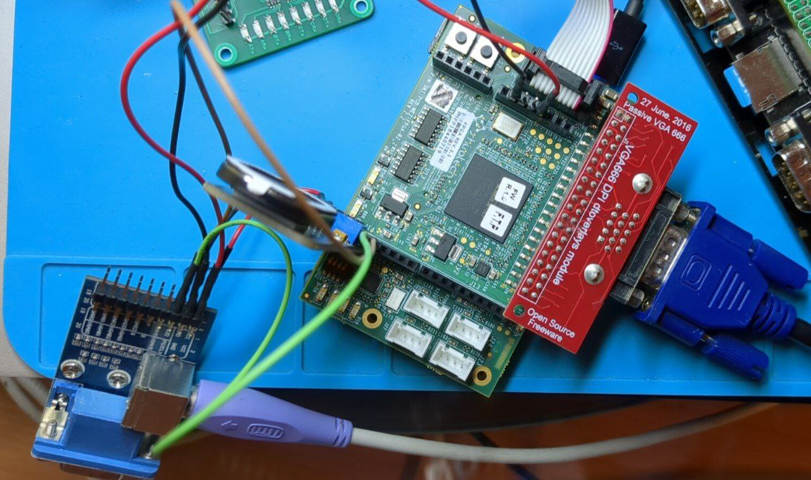

# 9.1 Arcade Pooyan 

[FPGA_Mezzanine](FPGA_Mezzanine/) is the  project for the addon level shifter board. It translates 1V8 to 3V3 voltage levels between Chameleon96 and VGA/Audio/PS2 interfaces.

[Pooyan](Pooyan/) is the Pooyan core for the Chameleon96 board.

