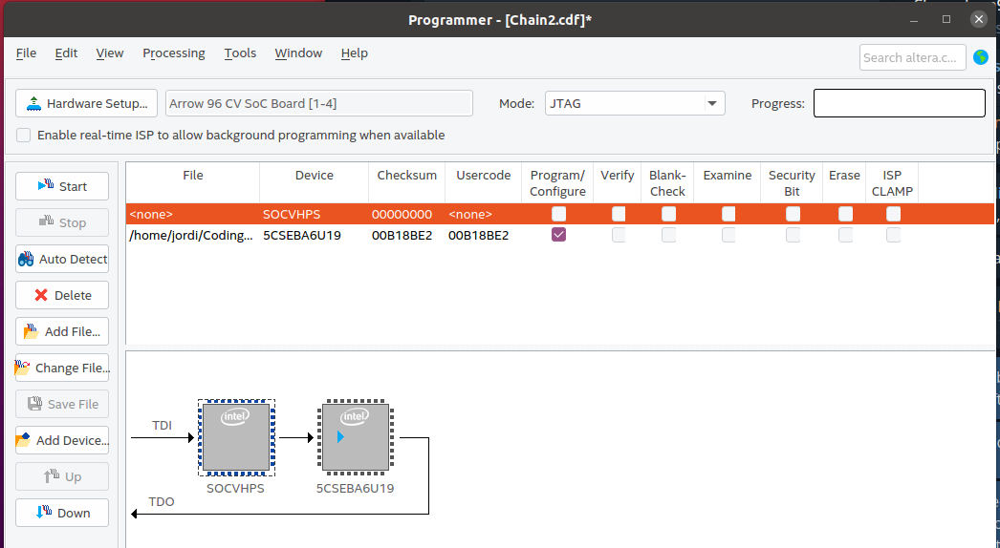

# Blink upload tutorial for totally newbees to Quartus and Chameleon96
### Table of contents

* Intro 
	* Objective 
	* Prerequisites 
	* Considerations 
	* Sources of information 
	* Download files 
* Preparation 
* Steps for loading first blink example 
* Final considerations 


Intro
-----

### Objective

Upload a ready made blink example core to your Chameleon96 board. 
The leds used are the WIFI and the BT leds next to the USB ports in the Chameleon96 board.

### Prerequisites

* [Chameleon96 board](https://www.96boards.org/product/chameleon96/)
* [Quartus lite sofware](https://fpgasoftware.intel.com/?edition=lite)


### Considerations
This tutorial has been made with this software setup: 

* OS Ubuntu 20.04. 
* Quartus lite 20.1


There shouldn't be any major problem for following this tutorial with older versions of Quartus and/or if you are on Windows OS.

### Sources of information

* [Chameleon96 telegram group](https://t.me/Chameleon96)
	* Note: credits for the very first blink code goes to our community member Yo_Me
* [github.com/somhi/kameleon96/](https://github.com/somhi/kameleon96)


### Download files

* Binary core for blink example]([./CV_96_blink_Yo_Me.sof](./README_files/CV_96_blink_Yo_Me.sof)) 


Preparation
-----------

For board detection I had to add following udev rules:

  sudo nano [/etc/udev/rules.d/81.fpga-altera.rules](file:///etc/udev/rules.d/81.fpga-altera.rules)

```
  # Intel FPGA Download Cable II
  SUBSYSTEMS=="usb", ATTRS{idVendor}=="09fb", ATTRS{idProduct}=="6010", MODE="0666"
  SUBSYSTEMS=="usb", ATTRS{idVendor}=="09fb", ATTRS{idProduct}=="6810", MODE="0666"
```


  sudo udevadm control --reload

Steps for loading first blink example
-------------------------------------


* Power up the board with original SD inserted


* Shutdown linux (recommended step by community member Sysadmin)


  Shutdown linux properly from console (I got an error when trying to shutdown from graphical interface). 
  Access the linux console though HDMI output or from serial output with an USB-TTL cable. 
  
Pins B W G on board correspond to colors from usb-ttl included in the kit.
  B = Black (Ground), W = White (Rx), 	G = Green (Tx)
	
From host computer:  
picocom -b 115200 /dev/ttyUSB0   
  login: root  
  shutdown -h now


* Connect the micro usb cable to the Blaster usb port (next to the black low speed expansion port)


* Run Quartus software  (binary is in the installation folder .../intelFPGA_lite/20.1/quartus/bin/quartus   in my setup)


* Open the programmer (Tools menu > Programmer)


Now a blue led in the board should be on indicating the programming usb blaster cable is connected and ready to go.


* Hardware Setup... > Hardware Settings


  In available hardware items shoud show up the "Arrow 96 CV SoC Board". Double click on it and press Close button.
  If no hardware is detected double check the udev rules.
  Check also output from command .../quartus/bin/jtagconfig -d


* Add File...   load the .sof blink example


* Add Device... > Soc Series V > double click SOCVHPS > Ok


* Select the "SOCVHPS" and press "Up" button so configuration should be like this:





* Finally press the "Start" button and after a few seconds you should have both leds (Wifi & BT) blinking ;)


Final considerations
--------------------


* You can now power down the board
* Next time you power up the board it will load linux normally (because u-boot reprograms the FPGA with the default file CV96.rbf from SD card and linux is loaded)
* It is possible to convert the blink project into rbf format and substitute CV96.rbf in the SD card so the board will always start with the blinking program.
* It is possible to program the FPGA without inserting SD card on startup (in this case the blinking frecuency will be slower).


