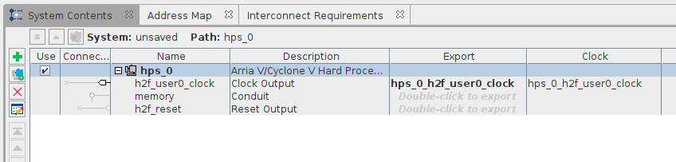
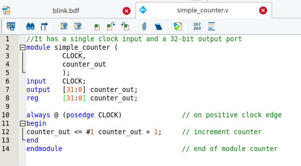
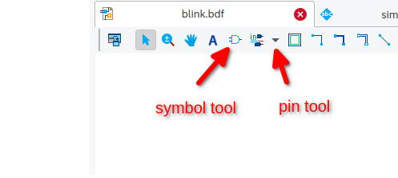
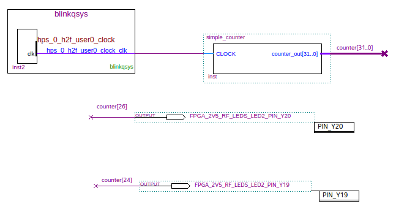
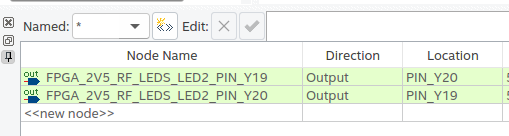
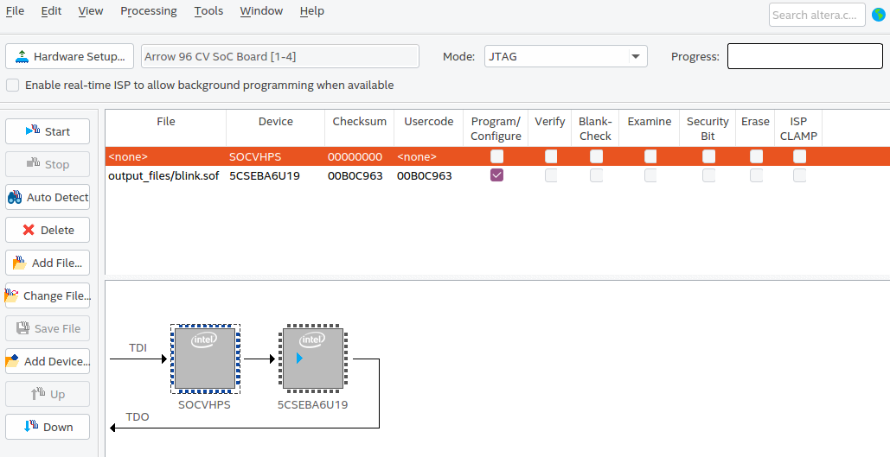

# Blink example
by @somhic

**Prerequisites**

* Chameleon96 board
* Quartus lite software

**Considerations**
This tutorial has been made with this software setup:

* OS Ubuntu 20.04
* Quartus lite 20.1

**Sources of information**

* [My_First_HPS.pdf](https://www.terasic.com.tw/cgi-bin/page/archive_download.pl?Language=English&No=1046&FID=86a1c2f74b7ff8a8abf58d2b4689d4be) by Terasic

Launch Quartus app
------------------

File > New project wizard
Next > choose folder and project name (e.g. blink), Next  > empty project, Next > Next >
type 5CSEBA6U19I7  in name filter, Next > Next > Finish

File > New > Block Diagram/Schematic File 
 
File > Save as >  Blink.bdf
 
File > New > Qsys System file		this opens Platform designer

Platform designer (Qsys)
------------------------

System contents window > select clk_0 > right click > remove

IP catalog > search "hps" > select "ArriaV/Cyclone V HPS" > Add

ArriaV/Cyclone V HPS configuration window 
FPGA interfaces > uncheck Enable MPU ...
AXI Bridges > put all 3 to Unused
	
FPGA-to-HPS SDRAM Interface
select  f2h_sdram0 and remove it with minus icon
	
HPS Clocks > Output clocks > HPS-to-FPGA User Clocks
check Enable HPS-to-FPGA user 0 clock

Finish to close window

System contents window > 
h2f_user0_clock >  double click on Export field
memory > double click and delete "memory" from Export field

Menu File > Save as >  /blink/blinkqsys.sys

Click Generate HDL button at bottom page
Create block symbol file checked 
Output directory path > ../blink/blinkqsys
Generate 
Close
Finish button
Ok

#### Important step to avoid compiling errors

Outside quartus and Qsys, open with a text editor the generated file /blink/blinkqsys/synthesis/submodules/hps_sdram_p0.sdc, remove all it's content and save it.

Quartus app
-----------

File > New > Verilog HDL File 

Paste following content: 
	//It has a single clock input and a 32-bit output port
	module simple_counter (
				CLOCK,
				counter_out
				);
	input 	CLOCK;
	output 	[31:0] counter_out;
	reg 	[31:0] counter_out;
	
	always @ (posedge CLOCK)  	     		// on positive clock edge
	begin
	counter_out <= #1 counter_out + 1;		// increment counter
	end
	endmodule								// end of module counter

Menu File > Save as >  simple_counter.v

File > Create/Update > Create Symbol Files for Current File

Menu Project > Add/Remove files in project  > ...  > select ./blinkqsys/synthesis/blinkqsys.qip, click  Open > Ok

Go back to Block editor window (blink.bdf)  

Symbol tool  >  libraries > Project/blinkqsys/blinkqsys > Ok
Insert block in page and press esc key

Symbol tool > libraries > Project/simple_counter > Ok
Insert block in page and press esc key

Pin tool > Insert two output pins on the page
Double click on pin_name1  > pin name > type FPGA_2V5_RF_LEDS_LED2_PIN_Y20
Double click on pin_name2  > pin name > type FPGA_2V5_RF_LEDS_LED2_PIN_Y19

Block diagram final schematic: 

Draw a connection wire between blinkqsys block output  "hps_0_h2f_user0_clock_clk"  and "CLOCK" input of the simple counter.

Draw a bus line connected on the output of the simple_counter output port, and leave the other end unconnected to the right of the simple_counter.
Select the created bus line > right click > properties > type counter [31..0] as the bus name.  
Note: The notation [X..Y] is the Quartus II method for specifying the bus width in BDF schematics, where X is the most significant bit (MSB) and Y is the least significant bit (LSB).

Draw a wire connected on the left of both output pins, and leave the other end unconnected.
Select the  first line > right click > properties > type counter [26] as the node name.
Select the  second  line > right click > properties > type counter [24] as the node name.

NOTE:  Without SD card inserted, HPS clock frequency is 25 MHz (100 MHz with original SD inserted)
To calculate the time period (T) of the blinking you have to calculate like this:       1/((25000000/(2^26)))  
where 25 corresponds to the 25 MHz and 26 is the bit of the counter we typed in the output pin  (counter[26])

File > Save

In preparation for pin assignments:
Processing > Start > Start Analysis & Elaboration 

Assignments > Pin Planner

Bottom table >   FPGA_2V5_RF_LEDS_LED2_PIN_Y20    > Location >  PIN_Y20
Bottom table >   FPGA_2V5_RF_LEDS_LED2_PIN_Y219   > Location >  PIN_Y19
	
File > close

And finally...

Processing  >  Start compilation

Programming the core into the FPGA
----------------------------------

* Connect the micro usb cable to the Blaster usb port (next to the black low speed expansion port)

* Tools > Programmer

Now a blue led in the board should be on indicating the programming usb blaster cable is connected and ready to go.

* Hardware Setup... > Hardware Settings

In available hardware items should show up the "Arrow 96 CV SoC Board". Double click on it and press Close button. 
If no hardware is detected then you have to configure the udev rules (see below)

* Add Device... > Soc Series V > double click SOCVHPS > Ok

* Select the "SOCVHPS" and press the "Up" button so configuration should be like this:

* Finally press the "Start" button and after progress is 100% (successful) you should have both leds (Wifi & BT) blinking  ;)  at different frequencies.

#### Configure hardware in linux (udev rules)

For board detection I had to add following udev rules in linux shell:

sudo nano /etc/udev/rules.d/81.fpga-altera.rules

	# Intel FPGA Download Cable II
	SUBSYSTEMS=="usb", ATTRS{idVendor}=="09fb", ATTRS{idProduct}=="6010", MODE="0666"
	SUBSYSTEMS=="usb", ATTRS{idVendor}=="09fb", ATTRS{idProduct}=="6810", MODE="0666"

sudo udevadm control --reload

